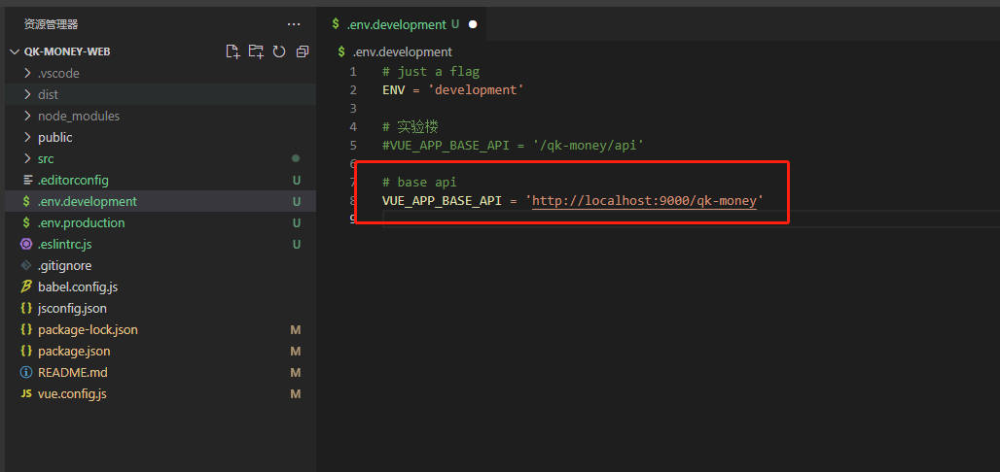

# lq-money-pos

## 启动指南

1. 创建 & 初始化数据库

    - 命令行方式：`mysql -u root < qk_money.sql`
    - 图形化如 Navicat

    [](https://github.com/ycf1998/qk-money/blob/main/README.assets/image-20230612234418878.png)

2. 修改数据库连接信息

    [](https://github.com/ycf1998/qk-money/blob/main/README.assets/image-20230612234100801.png)

3. 修改 oss.properties 下的目标空间

    ```properties
    # 目标空间
    local.bucket = D:/qk-money/
    ```

4. 运行 qk-money-biz 下 QkMoneyApplication 的 Main 函数

5. 前端工程修改 为后端路径（代码已修改，可忽略该步骤）

    
